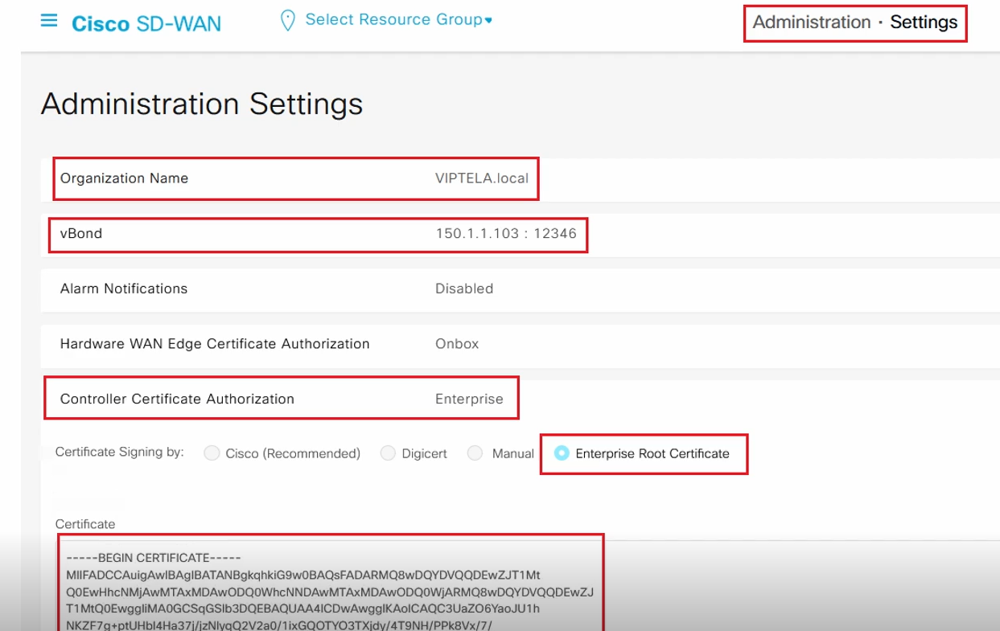

# Enabling Enterprise Certificates on vManage

- **vManage listens for HTTPS for GUI management via web browser**
  - Allowed in Management VPN (512) by default
  - Can be allowed in Transport VPN (0) with `allow-service [https | all]` under CLI:
    - `conf t ; vpn 0 ; interface [int] ; tunnel-interface ; allow-service https`

- **vManage trusts Cisco’s Certificate Authority (CA) by default**
  - Allows for very simple Zero Touch Provisioning (ZTP)

- **For internally hosted controllers, set to Enterprise Root Certificate on vManage:**
  - Administration > Settings
    - Set org, e.g. VIPTELA.local
    - Set vBond IP address
    - Set Controller Certificate Authorization to Enterprise Root Certificate
    - Paste your private Root CA Certificate

---

## Example: vManage GUI - Enterprise Certificate Settings

