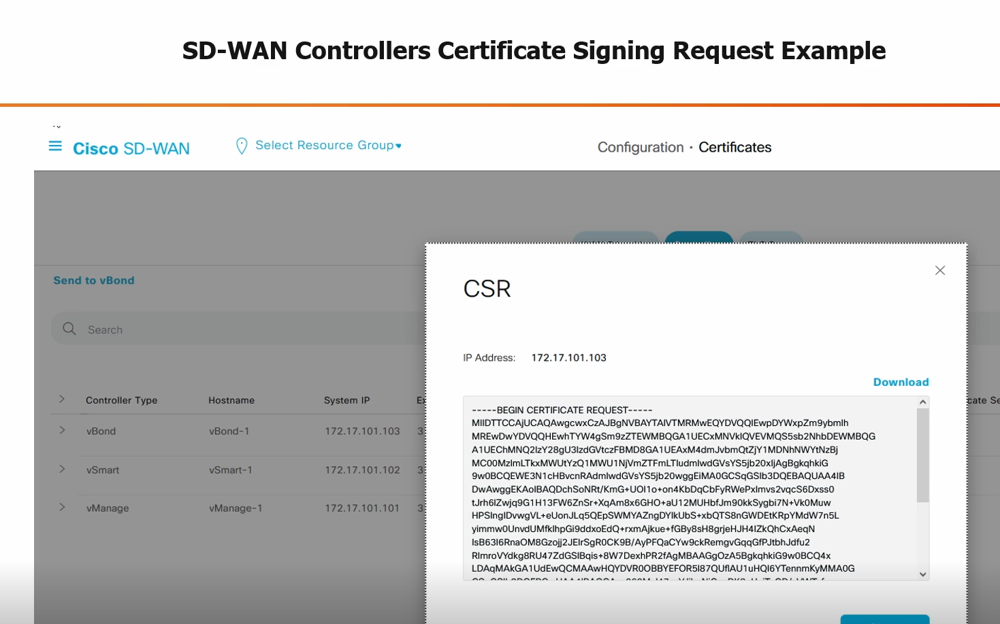
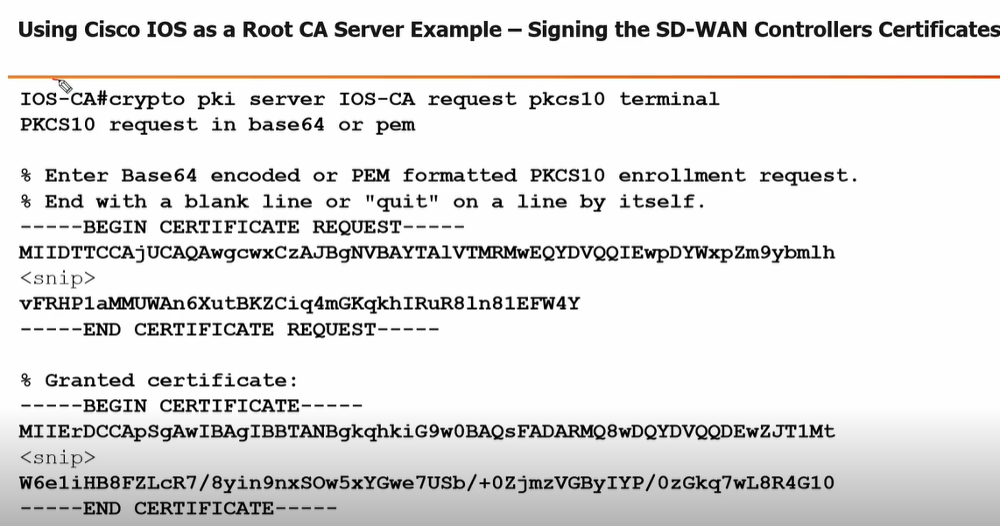

# Signing the Controllers Certificates (CSR)

**All controllers must generate Certificate Signing Requests (CSRs), which are then signed by the internal Root CA**
---

## Steps to Sign Controller Certificates

### 1. Add New vSmart & vBond Controllers from vManage
- **Navigation:**
  - `vManage > Configuration > Devices > Controllers > Add Controller`
- **Actions:**
  - Add vBond IP address, credentials, and **Generate CSR**
  - Add vSmart IP address, credentials, and **Generate CSR**

### 2. View Certificate Signing Requests from vManage
- **Navigation:**
  - `vManage > Configuration > Certificates > Controllers > ... > View CSR | Generate CSR`

#### SD-WAN Controllers Certificate Signing Request Example

### 3. Signing the SD-WAN Controllers Certificates

#### Example Using Cisco IOS as a Root CA Server

> **Tip:** Ensure all controller CSRs are signed by the internal Root CA before proceeding with further onboarding or configuration steps.
