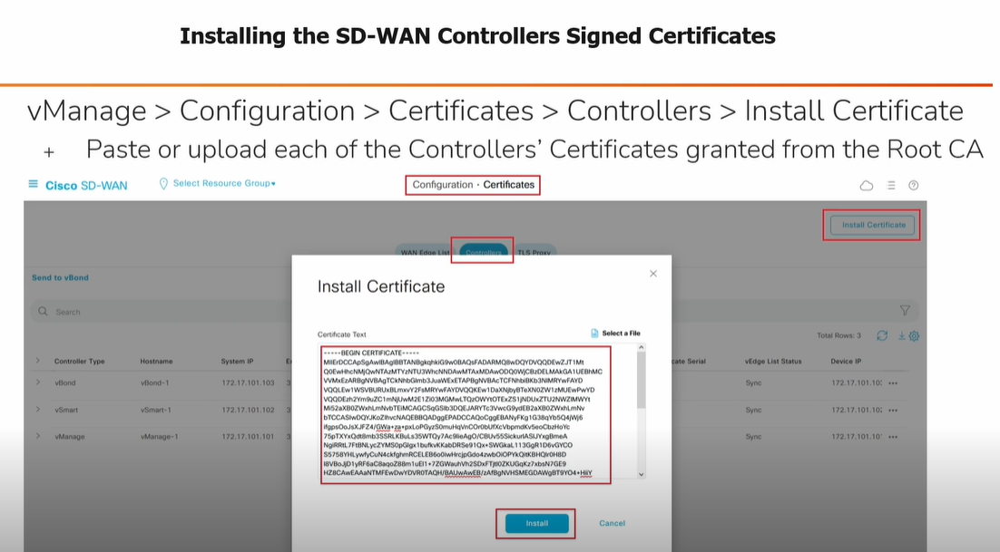

# Signing the Controllers Certificates (CSR)

All controllers must generate Certificate Signing Requests (CSRs), which are then signed by the internal Root CA

---

## Steps to Sign Controller Certificates

### 1. Add New vSmart & vBond Controllers from vManage
- **Navigation:**
  - `vManage > Configuration > Devices > Controllers > Add Controller`
- **Actions:**
  - Add vBond IP address, credentials, and **Generate CSR**
  - Add vSmart IP address, credentials, and **Generate CSR**

### 2. View Certificate Signing Requests from vManage
- **Navigation:**
  - `vManage > Configuration > Certificates > Controllers > ... > View CSR | Generate CSR`

#### SD-WAN Controllers Certificate Signing Request Example

### 3. Signing the SD-WAN Controllers Certificates

#### Example Using Cisco IOS as a Root CA Server

---

### 4. Installing the SD-WAN Controllers Signed Certificates

- **Navigation:**
  - `vManage > Configuration > Certificates > Controllers > Install Certificate`
- **Action:**
  - Paste or upload each of the Controllers’ Certificates granted from the Root CA

> **Tip:** After installing, verify certificate status for each controller in the vManage GUI.
