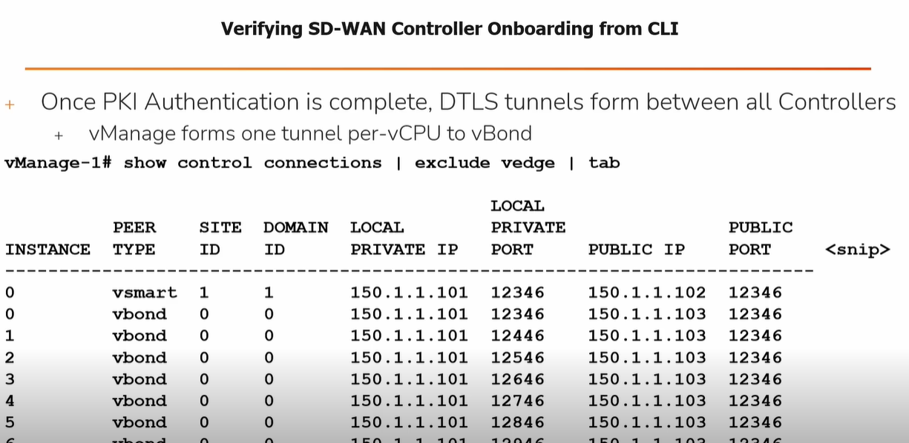

# Verifying & Troubleshooting SD-WAN Controller Onboarding from CLI

## Verifying DTLS Connections
- **show control connections** from vManage, vSmart, & vEdge
- **show orchestrator connections** from vBond

## Troubleshooting Failed Onboarding
- **show control connections-history** from vManage, vSmart, & vEdge
- **show orchestrator connections-history** from vBond
- Check **LOCAL ERROR** & **REMOTE ERROR** fields against legend

> **Tip:** Use the above commands to verify tunnel status and diagnose onboarding issues between controllers.
