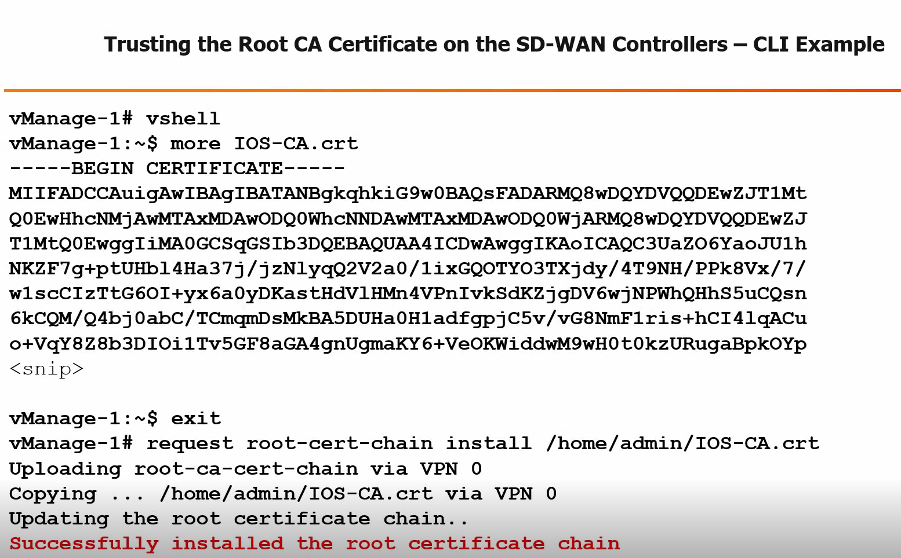

# Trusting the Root CA Certificate on the SD-WAN Controllers

## Manual Installation Steps

- All three Controllers must manually install your private Root CA Cert:
  - Run `vshell` from Controllers CLI to drop to Linux shell
  - Copy the Root CA Cert to filesystem with SCP/TFTP
  - Could also use `vi MyCA.crt` and paste Cert in
  - When complete, `exit` vshell

## Install the Root CA Cert from all Controllers CLI

```shell
vManage-1# request root-cert-chain install /home/admin/MyCA.crt
```

## Sync the Root CA Cert in the vManage database (required)

- [https://<vManage-ip-address>/dataservice/system/device/sync/rootcertchain](https://<vManage-ip-address>/dataservice/system/device/sync/rootcertchain)

---

## Example: CLI Installation and Verification


