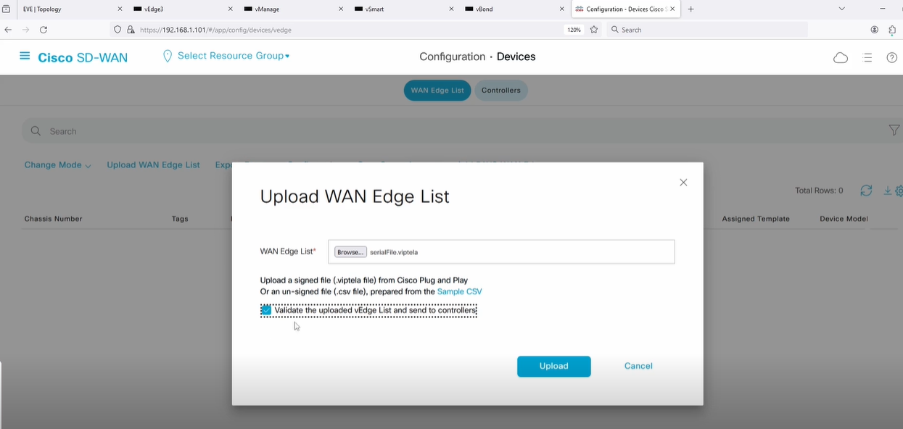

# Cisco SD-WAN Edge Routers overview

## Edge Router Variations
- **vEdge Routers** running Viptela OS
  - End-of-Sale Jan 2023, but supported until Jan 2028
- **cEdge Routers** running Cisco IOS XE SD-WAN

## Physical and Virtual Form Factors
- Both vEdge & cEdge Routers come in physical and virtual form factors
  - E.g. vEdge-1000 vs. vEdge Cloud
  - E.g. Cisco ISR 4000 vs. Catalyst 8000v

## Features
- Features are similar between vEdge & cEdge, but different syntax and capabilities

---

# Onboarding Cisco SD-WAN vEdge Routers: 

### Step -1 : Minimum CLI Options

- Host-name
- System-ip (unique, does not need to be routable)
- Site-id (devices in same site don’t form IPsec tunnels with each other)
- Organization-name (must match the ORG in serialFile.viptela)
- vBond IP Address (orchestrator)
- VPN 0 (Transport VPN): interface(s), IP address(es), routing, tunnel color

---

#### Example vEdge Router Initial CLI Config

```shell
config
!
system
 host-name vEdge-2
 system-ip 172.17.2.2
 site-id 2
 organization-name VIPTELA.local
 vbond 150.1.1.103
!
vpn 0
 interface ge0/0
  ip address 150.11.1.0/31
  tunnel-interface
   encapsulation ipsec
   color biz-internet
   allow-service all
   no shutdown
  !
 ip route 0.0.0.0/0 150.11.1.1
!
commit and-quit
```

---

### Step -2: Installing a Private Root CA Certificate on the vEdge Router

If not using Cisco Cloud for PKI, install the Root CA Cert:

```shell
vEdge-2# vshell
vEdge-2:~$ vi MyCA.crt
#   "i" to insert in vi
#   Paste the Root CA Certificate
#   <esc> :wq to save and quit
vEdge-2:~$ exit
vEdge-2# request root-cert-chain install /home/admin/MyCA.crt
```
---

### Step-3: Uploading and Syncing the WAN Edge List

- **vBond Orchestrator** needs to know the list of Chassis Numbers & Serial Numbers of the WAN Edge Routers to authenticate & onboard them.
  - Can be done automatically through vManage sync to Cisco Smart Licensing
  - Done manually by uploading the `serialFile.viptela` from Cisco Licensing Portal
    - vManage > Configuration > Devices > Upload WAN Edge List
    - Check the box to "send to controllers" to sync to vBond


- vBond must have the WAN Edge List synchronized with vManage
  - WAN Edge List not synced will result in DTLS tunnel failure
    - i.e. onboarding fails if vBond can’t authenticate the WAN Edge Router
  - Can be re-synced from vManage > Configuration > Certificates > WAN Edge List > Send to Controllers
  - Verified with `show orchestrator valid-vedges` from vBond CLI



> **Tip:** Always ensure the WAN Edge List is up to date and synchronized to avoid onboarding failures.

### Step-4: Update Chassis Number and token otp on vEdge

##### Once the WAN edge List is uploaded and syned to vBond , then go to vManage > Configration > Devices

- Choose appropriate chassis number from the list then "generate Bootstrap Configration" from the right
- Copy the UUID and OTP field
- Then enter following comand on the vEdge CLI:

  ```
  request vedge-cloud activate chassis-number UUID token OTP
  
  ```


### Step-5: Verficatio

Once the WAN Edge Router is configured, verify the onboarding status:

```
show control connections
```

It will form DTLS session with vBond

```
show control local-properties
```
The certficate status now shows "installed" and "valid" and token shows "invalid"


