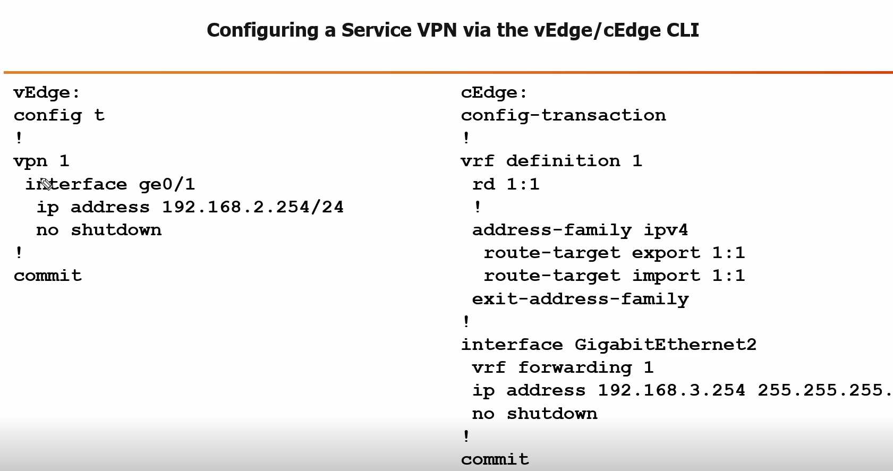

### Cisco SD-WAN Service VPNs and Overlay Management Protocol (OMP)

### Service VPNs Purpose
- These VPNs handle traffic inside IPsec tunnels between SD-WAN sites.
- Great for private-to-private traffic.
- They create a full-mesh connectivity within the same VPN.
- All VPN 1 sites can chat with each other, but not with VPN 2 sites, and vice versa.

### VPN Number Encoding
- The Service VPN Number is encoded as an MPLS Label in the custom IPsec header.
- For vEdge (Viptela OS), VPNs 1-511 are for Service VPNs.
- VPN 0 is for Transport, and 512 is for MGMT.
- For cEdge (IOS XE), it uses VRF numbers.
- The global default VRF maps to VPN 0, VRF 1 to VPN 1, VRF 2 to VPN 2, and so on.

### Data-Plane Action
- When an SD-WAN Edge Router gets a packet in an IPsec tunnel, it uses the MPLS Label.
- The label helps figure out which routing table (VPN/VRF) to look up in.

### Control-Plane Similarity
- SD-WAN routing is like MPLS L3VPN (BGP VPNv4 AFI).
- In L3VPN, BGP VPNv4 routes include prefix/len, Route Target (RT), and MPLS Labels.
- The RT defines which routing table the prefix belongs to.
- This segments customer info for multi-tenancy.
- The BGP-learned MPLS Label is used in data-plane encapsulation.
- The receiving Edge Router maps it to the right Service VPN Number.
### OMP Basics
- OMP is like a BGP-style protocol that shares prefixes with cool attributes.
- Attributes include VPN Number, Transport Location (TLOC), Color, Site-ID, and Tags.
- These can later help with smart routing policies like Application Aware Routing (AAR).

### How OMP Works
- It automatically runs between WAN Edge Routers and the vSmart Controller over DTLS tunnels.
- These tunnels are set up during onboarding.
- WAN Edge Routers share connected, static, BGP, OSPF, or IS-IS routes into OMP.
- OMP then sends them to the vSmart.
- By default, it redistributes connected routes and OSPF Internal on vEdge (but not cEdge).
- vSmart acts like a BGP Route Reflector.

### No Direct OMP Between Edges
- WAN Edge Routers don’t talk OMP directly with each other.
- They only communicate through vSmart.
- vSmart takes the routes, applies path selection rules, and reflects them back to the WAN Edges.

### Example configration of VPN Configration

